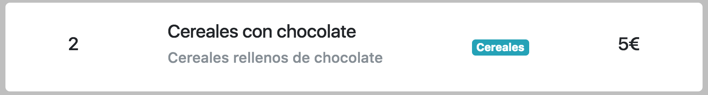

# 3.4 Componentes en React

## Contenidos <a id="contenidos"></a>

* ​[EJERCICIO 1](https://books.adalab.es/materiales-front-end-i/modulo-3.-react/3_5_componentes_react#ejercicio-1)​
* ​[EJERCICIO 2](https://books.adalab.es/materiales-front-end-i/modulo-3.-react/3_5_componentes_react#ejercicio-2)​
* ​[EJERCICIO 3](https://books.adalab.es/materiales-front-end-i/modulo-3.-react/3_5_componentes_react#ejercicio-3)​
* ​[EJERCICIO 4](https://books.adalab.es/materiales-front-end-i/modulo-3.-react/3_5_componentes_react#ejercicio-4)​

## Introducción <a id="introduccion"></a>

Hasta ahora hemos visto cómo crear componentes sencillos y decirle a React que se encargue de pintarlos.

En esta sesión veremos cómo definir componentes más completos y robustos, y exploraremos las diferentes maneras de relacionar nuestros componentes entre sí.

## ¿Para qué sirve lo que vamos a ver en esta sesión? <a id="para-que-sirve-lo-que-vamos-a-ver-en-esta-sesion"></a>

Según vayamos creando aplicaciones web más grandes con React, necesitaremos definir mayor número de componentes que se relacionarán entre sí. Veremos cómo se relacionan los componentes padre/madre con los componentes hijo/hija, y un tipo especial de componente que tendrá más componentes arbitrarios en su interior.

También necesitaremos crear componentes con mayores garantías de funcionar. Para eso veremos `propTypes`, para obligar a las `props` a ser de un tipo de dato concreto, y cómo asignarles valores por defecto para hacer `props` opcionales.

## Componentes padre e hijo \(madre e hija\)

Vimos en la sesión anterior cómo usar un componente dentro de otro: el componente `CatList` renderizaba tres componentes `RandomCat`. Para referirnos a componentes que renderizan otros usaremos el término **componente padre o madre**, y para referirnos a componentes que son renderizados por otros, **componente hijo o hija**.

> No debemos confundir esta terminología con la terminología de la herencia de clases. Aunque las dos tengan jerarquía, esta terminología representa relaciones de **composición**, no de herencia.

Los componentes padre/madre pueden tener múltiples componentes hijo/hija, pero los componentes hijo/hija solo tienen un componente padre/madre. Cabe destacar que un componente puede ser hijo/hija de un componente padre/madre y a la vez ser padre/madre de otros componentes hijo/hija.

```text
                  ┌───────────┐
                  │  CatList  │
                  └─┬───┬───┬─┘
                    ┊   ┊   ┊
       ┌╌╌╌╌╌╌╌╌╌╌╌╌┘   ┊   └╌╌╌╌╌╌╌╌╌╌╌╌┐
       ┊                ┊                ┊
┌──────┴──────┐  ┌──────┴──────┐  ┌──────┴──────┐
│  RandomCat  │  │  RandomCat  │  │  RandomCat  │
└─────────────┘  └─────────────┘  └─────────────┘
```

Estas relaciones forman una jerarquía importante para entender React. Desde los componentes padre/madre podremos pasar datos _hacia abajo_ a los componentes hijo/hija, mediante las `props`, pero **no al revés**. Un hijo/a no podrá pasar datos _hacia arriba_ libremente. Veremos en una sesión posterior cómo "solucionar" los problemas que _a priori_ parece generar este **flujo unidireccional**.

## Ejemplos de app con varios componentes y cómo se pasan datos con las `props`

Vamos a ver un ejemplo para entender mejor el paso de información de un componente a sus hijas. Partimos de un componente `Item` que es un artículo que tenemos en una lista de la compra:



Como vemos en la imagen, un Item tiene estas propiedades:

* nombre
* descripción
* cantidad
* categoría
* precio

Vamos a crear un componente `Item` con estas características, pero que los valores de esas propiedades le lleguen por `props`:

```jsx
const Item = props => {
    return (
      <div className="item">
        <h5 className="quantity">{props.quantity}</h5>
        <div>
          <h5>{props.name}</h5>
          <h6 className="text-muted">{props.description}</h6>
        </div>
        <div className="badge badge-info">{props.category}</div>
        <h5 className="price">{props.price}€</h5>
      </div>
    );
}
```

Ahora, desde un componente padre para crear un `<Item>` y pasarle la información por `props` lo hacemos así \(recordad que esto es JSX pero es la sintaxis de HTML que ya conocemos\):

```jsx
<Item
  name="Cereales con chocolate"
  description="Cereales rellenos de chocolate"
  quantity={2}
  category="Cereales"
  price={5}
/>
```

Fíjate que cuando queremos pasar datos distintos a una cadena, tendremos que usar los {} para incrustar JS, en este caso, para meter un número.

> NOTA: el valor de los atributos de un componente en JSX debe ser **SIEMPRE** una cadena \(entre comillas\) o una expresión JS \(entre llaves\)

Para ver mejor cómo funciona, hemos creado otro componente `ItemList` que nos sirve para manejar listas de items. En este caso, va a pintar varios componentes `Item`:

```jsx
const ItemList = () => {
  return (
    <ul className="item-list">
      <li>
        <Item
          name="Cereales con chocolate"
          description="Cereales rellenos de chocolate"
          quantity={2}
          category="Cereales"
          price={5}
        />
      </li>
      <li>
        <Item
          name="Hamburguesa con queso"
          description="Hamburguesa rica y saludable"
          quantity={1}
          category="Fast-food"
          price={15}
        />
      </li>
      //...
    </ul>
  );
}
```

#### ---

#### EJERCICIO 1

Echa un ojo al [ejemplo anterior en codepen](https://codepen.io/adalab/pen/XVoVOa?editors=0110), e intenta añadir un nuevo `Item` a la lista.

**EJERCICIO 2**

Ahora tenemos los datos de cada item en un array de objetos \(como variable global\):

```jsx
const items = [
  {
    name: 'Cereales con chocolate',
    description: 'Cereales rellenos de chocolate',
    quantity: 2,
    category: 'Cereales',
    price: 5
  },
  {
    name: 'Hamburguesa con queso',
    description: 'Hamburguesa rica y saludable',
    quantity: 1,
    category: 'Fast-food',
    price: 15
  },
  {
    name: 'Agua mineral',
    description: 'Agua de un charco del Himalaya',
    quantity: 2,
    category: 'Bebida',
    price: 5
  }
];
```

A\) ¿Serías capaz de crear el JSX en la sentencia `return` de `ItemList` usando un bucle o un `map`? Para hacerlo debes saber que para pintar varios componentes en JSX basta con crear un array con cada JSX y devolverlo en una expresión entre {}.

B\) Ahora vamos a filtrar el array antes convertirlo a JSX con `map`, tirando de nuestra amiga `filter`. Mostraremos en la página solo los productos cuyo precio es inferior a 10.

## Uso de `children` para acceder a los componentes hijo cuando no los conoces

Algunas veces, al declarar un componente no sabremos o no nos importará qué otros componentes podrá contener dentro. Por ejemplo, un componente `Popup` o un componente genérico `Header`. En esos casos podremos usar una `prop` especial, `children`, para pasar directamente elementos sin importar cuáles sean:

```jsx
import React from 'react';

const Popup = props => {
  return (
    <div className={`alert alert-${this.props.styling}`} role="alert">
      {props.children}
    </div>
  );
}

export default Popup;

//El componente se pintará como
<Popup styling="info">
  <h1 className="horizontal-center">Welcome</h1>
  <p>Thank you for visiting our webpage!</p>
  <p>We hope you enjoy our new shiny site!</p>
</Popup>
```

Como se puede observar en el ejemplo, inyectaremos `props.children` en el JSX del componente genérico como una variable cualquiera. Cuando usemos el componente, escribiremos el contenido en JSX dentro de sus etiquetas de apertura \(`<Popup>`\) y de cierre \(`</Popup>`\).

#### EJERCICIO 2

Desarrolla un componente `HalfPage` que todo su contenido lo ponga en la mitad izquierda de la pantalla \(mitad de ancho y todo el alto\). Usa `children` para introducir todo el contenido entre la apertura y cierre de `HalfPage` en su interior. Crea 2 componentes `HalfPage` con algo de contenido HTML \(en JSX\) para ver cómo se posiciona en una mitad y la otra.

## Valores por defecto de las `props`

En ocasiones querremos definir que algunas `props` no sean obligatorias, y cuando no se pasen querremos usar un valor por defecto. Esto se puede conseguir en React con `defaultProps`. Será un objeto con el nombre de las `props` que queremos que tengan valor por defecto y su correspondiente valor, y cuando se instancie el componente, se cogerán las `props` que falten de ese objeto. Lo definimos como una propiedad del componente, `NombreDelComponente.defaultProps = {}`, antes de exportar el componente:

```jsx
import React from 'react';

const Button = props => {
  return (
    <button
      className={`btn btn-${props.styling}`}
      type="button"
      name="button"
    >
      {props.label}
    </button>
  );
}

// Así definimos las defaultProps
Button.defaultProps = {
  styling: 'primary', // from Bootstrap classes: primary, secondary, success, info, warning, danger, link
  label: 'Aceptar'
};

export default Button;
```

> No hace falta importar el paquete `prop-types` para usar valores por defecto

#### EJERCICIO 3 por aquiiii

Partiendo del código del ejercicio 1, usa las `defaultProps` para que la descripción del item sea opcional y si no nos lo pasan por `props` aparezca 'No hay descripción'.

#### 

