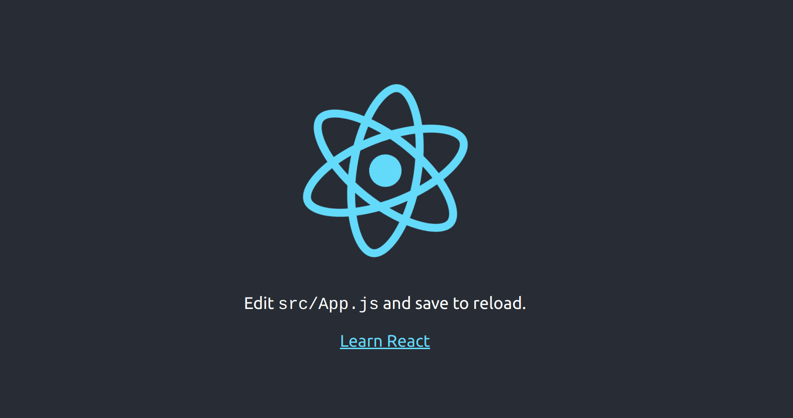

# 3.2 Intro a React I

## Introducción

En esta sesión nos iniciaremos en la librería [React.js](https://reactjs.org/). React es una librería para crear interfaces de usuario que se creó en 2013 en el seno de Facebook y es una de las librerías más demandadas en el mundo del desarrollo frontend.

##  ¿Para qué sirve lo que vamos a ver en esta sesión?

Es muy común en todos los ecosistemas de programación usar librerías o _frameworks_ que permiten terminar productos mucho más rápido y ahorran escribir código. Javascript no es una excepción, y en su historia, podemos contar varias librerías y _frameworks_ populares como jQuery —que suplió las carencias iniciales del lenguaje mientras maduraba—, Backbone.js, Angular o Vue.js.

En particular, el manejo del DOM en proyectos grandes de Javascript, es una fuente de problemas. Desde las _single page applications_ \(SPAs\) se empezaron a desarrollar _frameworks_ que ayudaban a controlar esto, entre otras cosas. Hoy en día, React es una de las librerías más extendidas y maduras, con gran soporte de la comunidad y muchos recursos disponibles. React es una librería especializada en crear interfaces de usuario por medio de componentes. A pesar de ello se suele meter en el "saco de los frameworks de front-end".

En nuestra actividad profesional nos encontraremos con diferentes _frameworks_ y librerías. Aprender a usar una librería externa nos ayudará a enfrentarnos a estas situaciones en la vida real.

> **NOTA**: Investiga un poco más sobre la diferencia entre framework y librería en este enlace [https://www.openinnova.es/dif](https://www.openinnova.es/diferencia-entre-framework-y-libreria-javascript/)[erencia-entre-framework-y-libreria-javascript/](https://www.openinnova.es/diferencia-entre-framework-y-libreria-javascript/)

## ¿En qué casos y por qué se utilizan los _frameworks_ o las librerías?

Un framework o una librería Javascript, depende del caso, nos soluciona uno de los principales problemas de la programación front-end: mantener la **interfaz de usuario** \(UI, del inglés _User Interface_\) sincronizada con el **estado** nuestra aplicación.

Pero, _¿qué es el estado de una aplicación web?_ Una aplicación web, a diferencia de una simple página web, se encarga de **gestionar datos**. Por ejemplo, en una aplicación como GMAIL gestionamos datos de correos \(nuevos, leídos, archivados, etc.\) desde una interfaz. En una simple aplicación de una lista de tareas, manejamos datos de tareas, si están completados o las fechas de realización.

Volviendo a los frameworks y librerías, estos nos facilitan sincronizar el estado \(los datos\) con la interfaz \(lo que se ve en la pantalla\). Vamos a verlo con un ejemplo que ya conocemos: el juego de adivinar el número del módulo anterior. Necesitamos bastante código para tener sincronizado el estado del juego \(el _feedback_ sobre un intento y el número de intentos\) con la interfaz.

```jsx
function showFeedback(text) {
  const feedbackContainer = document.querySelector(".feedback");
  feedbackContainer.innerHTML = text;
}

function incrementTrials() {
  trials++;
  const trialsOnPage = document.querySelector(".trials");
  trialsOnPage.innerHTML = trials;
}
```

Este código de sincronización puede complicarse mucho \(como habéis podido comprobar en el proyecto grupal del módulo anterior\). Y está también muy acoplado a la interfaz \(cambiar el HTML implica cambios en el código\) por lo que es muy propenso a errores. Por esto, las librerías como React nos ayudan mucho, porque hacen esta sincronización por nosotros y nos evitan muchos problemas.

A parte de esta ventaja fundamental, otras ventajas de usar frameworks o librerías son:

* facilitan el trabajo con componentes web
* tienen extensiones del navegador que facilitan el _debugging_
* facilitan el desarrollo de SPAs \(del inglés _Single Page Applications_\)

## Qué es React

Hasta ahora hemos visto cómo crear webs escribiendo la vista en archivos HTML y la funcionalidad en archivos Javascript. La tendencia actual es escribir vista y comportamiento juntos, en lo que llamamos componentes, que serán reutilizables.

React es una librería que nos permite hacer componentes gráficos con los que estructurar nuestra web. Los componentes gráficos se pintarán "solos" en el DOM, sin que tengamos que manejarlo "a mano". Además, React detectará cuando nuestra aplicación maneja nuevos datos y actualizará como como cambian esos componentes, así crearemos webs muy reactivas y rápidas.

Es intuitivo hacer webs con React porque todo son componentes que llaman a otros componentes. El flujo es unidireccional \(de arriba abajo\), así que es fácil entender y solucionar los errores que pueda haber: si el error no está en mi componente, está en quien ha llamado a mi componente y cómo.

## Estructura de un proyecto en React

Un proyecto en React, en principio, tendrá un solo archivo HTML, y al menos un archivo Javascript desde el que importaremos la librería de React. Así que un proyecto mínimo tendrá la siguiente estructura:

```text
my-react-project
├── index.html
├── index.js
└── <dependencies>/
    ├── react.js
    └── react-dom.js
```

Sin embargo, trabajaremos con una estructura bien organizada para crear proyectos de mediano tamaño con `node` y `npm` más parecida a esta:

```text
my-react-project
├── .gitignore
├── package.json
├── node_modules
│   ├── react
│   └── react-dom
├── public
│   └── index.html
└── src
    ├── images
    │   └── logo.png
    ├── stylesheets
    │   ├── index.scss
    │   └── index.css
    ├── components
    │   └── a-component.js
    └── index.js
```

`npm` instalará las dependencias en la carpeta `node_modules`, de donde podremos importar módulos de JS como `react` y `react-dom` a nuestro código. Nuestro código se agrupará dentro de la carpeta `src`, excepto el único archivo HTML que usaremos, que estará en `public/index.html`.

Nuestros componentes de React irán en la carpeta `src/components`, cada uno en su fichero.

Basta de cháchara: ¡empecemos!

## "Hola, mundo" con `create-react-app`

Vamos a crear nuestro primer "¡Hola, mundo!" con React. Usaremos `create-react-app`, una herramienta generador que nos automatiza instalar React y Babel, que transformará código ES6 en ES5, y nos preconfigura un proyecto. ¡Manos a la obra!

Necesitaremos Node.js instalado, pero esto ya lo tenemos. Primero instalamos de forma global la utilidad de `create-react-app`, y luego creamos nuestro proyecto de React 'my-react-project' ejecutando esto en un terminal:

```text
npm install -g create-react-app
create-react-app my-react-project
```

Esto nos creará una carpeta `my-react-project` y dentro tendremos todo listo. Para verlo, entramos dentro de la carpeta y ejecutaremos el proyecto con `npm`:

```text
cd my-react-project
npm start
```

`create-react-app` nos ha instalado un _live-server_, así que sin cerrar el navegador ni el terminal, vamos a abrir el archivo `my-react-project/src/App.js` y probar a cambiar la frase "Welcome to React" por "¡Hola, mundo!". Guardamos y cambiamos al navegador.



## Estructura de un proyecto React creado con `create-react-app`

Cuando creamos un proyecto nuevo de React se nos crea una estructura de ficheros y carpetas, tal y como hemos visto antes. Vamos a ver cuáles son los ficheros principales que necesitamos conocer.

### `public/index.html`

Es el único fichero HTML que usaremos en nuestra aplicación. Podemos modificar algunas cosas pequeñas para personalizar la aplicación: añadir etiquetas `meta`, cargar fuentes, definir el título, etc. En el `body` se carga un `div` con identificador `root` que será donde se carga la aplicación de React.

### `src/index.js`

Este será el fichero JS de entrada a nuestra aplicación React. Será el único en el que carguemos `ReactDOM` y se encarga de acceder a un nodo del DOM \(el `div` que antes identificamos como `root`\) e importar y pintar el componente principal de la aplicación, en este caso, llamado `App`.

```jsx
import App from "./App";

ReactDOM.render(<App />, document.getElementById("root"));
```

Para pintar el componente `App` usamos una sintaxis un poco rara: _¡es como si `App` fuese una etiqueta del HTML!_  Vamos a verlo en más profundidad en el siguiente fichero.

### `src/App.js`

Este fichero corresponde a nuestro primer _componente_ de React, pero ya veremos qué es un componente más adelante. De momento, vamos a pensar que quizá al modificar el archivo `App.js` os haya sorprendido algo. _"¿Eso no era una etiqueta HTML? ¡Pero si es una función de Javascript!"_:

```jsx
import React from 'react';
import logo from './logo.svg';
import './App.css';

function App() {
  return (
    <div className="App">
      <header className="App-header">
        
        <p>
          Edit <code>src/App.js</code> and save to reload.
        </p>
        <a
          className="App-link"
          href="https://reactjs.org"
          target="_blank"
          rel="noopener noreferrer"
        >
          Learn React
        </a>
      </header>
    </div>
  );
}

export default App;

```

Esas etiquetas `div`, `header`, `img`, `h1` y `p` son una extensión de la sintaxis de Javascript que se llama **JSX**. JSX nos facilita escribir código que React transformará luego en elementos reales del DOM. De esta forma podemos definir fácilmente el contenido de un elemento porque usa la sintaxis de HTML que ya conocemos.

Como JSX no deja de ser **código Javascript**, lo podemos tratar como tal. Por ejemplo, podemos guardar elementos en una variable. También podemos usar expresiones Javascript dentro de esa sintaxis con `{` y `}`, como si fuera la interpolación de cadenas de ES6 \(pero sin `$`\):

```jsx
function App() {

  let titleText = <h1>Hola Mundo</h1>
  
  return (
    <div className="App">
      <header className="App-header">
        {titleText}
      </header>
    </div>
  );
}

export default App;
```

Como es HTML, podemos añadir atributos a los elementos que definamos con JSX:

```javascript
let titleText = <h1 className="App-title">Hola Mundo</h1>
```

> **NOTA**: `class` es una palabra reservada en Javascript, así que tendremos que usar `className` como nombre de atributo cuando queramos asignar una clase CSS

Por último, hay que destacar otra cosa de este fichero: estamos importando imágenes y CSS. _¿Y esooo?_ Pues porque en React podemos hacerlo, y además es una buena práctica trabajar de esta forma. Desde un componente \(fichero JS\) importamos las imágenes y CSS que necesitemos para montar su interfaz. Por debajo tenemos un automatizador  \(en este caso webpack\) que se encarga de importar los CSS desde el HTML \(para que el navegador los entienda\) y modificar las imágenes por su ruta para que puedan ser visualizadas. De momento nos quedamos con que _en React se hace así_.

## Cómo funciona JSX por detrás

Recordemos que JSX es una especie de combinación de HTML y Javascript, escribimos etiquetas parecidas al HTML que al final se convierten en código Javascript. Pero entonces, ¿por qué usamos JSX y no directamente escribimos Javascript? Porque la sintaxis de JSX es muy cercana a HTML, mucho más legible y simplifica el desarrollo de nuestros componentes. _¿Y si no usáramos JSX?_ Vamos a ver un ejemplo:

```javascript
const titleClassNames = "App-title";
const titleElement = <h1 className={titleClassNames}>¡Hola, mundo!</h1>;
```

Este ejemplo de JSX se transformará en este Javascript:

```javascript
const titleClassNames = "App-title";
const titleElement = React.createElement(
  "h1",
  { className: titleClassNames },
  "¡Hola, mundo!"
);
```

React pintará en el DOM el HTML correspondiente al JSX que se devuelve por medio del `return()` de mi componente. En este caso, el HTML quedará así:

```javascript
<h1 class="App-title">¡Hola, mundo!</h1>
```

Muy parecido al JSX que hemos escrito, ¿verdad?

---

**EJERCICIO 1**

Vamos a crear un nuevo proyecto de React llamado **mediacard**. Para ello en el método `return` de nuestro componente principal **App.js** vamos a maquetar de la misma manera que lo haríamos en un HTML normal el diseño que os proporcionamos. Podéis usar una imagen a vuestra elección en lugar de la que aparece en el diseño, y Font-Awesome para el icono del corazón. De esta forma, aprenderemos a cómo trabajar con cosas que ya conocemos \(HTML y CSS\) en una aplicación de React.


#### EJERCICIO 2

Partiendo del ejercicio anterior, vamos a aprender mejor cómo funciona JSX. Para ello vamos a asignar nombres a las variables, un tema que será importante cuando creemos nuestros componentes más adelante.

El objetivo será que el `return` de nuestro componente principal App.js devuelva una sola variable. Para ello, vamos a extraer a variables cada una de las "etiquetas" del contenido de nuestra MediaCard. Por ejemplo, una variable para la cabecera, y otra para el párrafo. Haremos que los nombres de nuestras variables sean descriptivos con respecto a lo que contienen y, cuando sea posible, cortos. Luego agruparemos esas variables en una última que sea la que se devuelva en nuestro `return`

```javascript
/* aquí irán el resto de variables que extraeremos */

const appRoot = (
    <div className="card">
    ...
    </div>
);
  
return appRoot;
```

> NOTA: Si escribimos el contenido de nuestro `return` en la misma línea, no necesitamos usar paréntesis a continuación, en caso contrario, necesitaremos envolver el contenido de nuestro `return` entre paréntesis.

## Interfaz declarativa VS imperativa

Con React haremos interfaces declarativas, en vez de imperativas. La programación declarativa nos permite focalizarnos en **el resultado final** de lo que programamos, en vez de en los detalles específicos de cómo se lleva a cabo el resultado. Recuerda que en Javascript tradicional necesitabas utilizar muchas líneas, cada línea una instrucción para nuestra aplicación. En React todo esto se simplifica mucho.

No tendremos que seleccionar qué elemento del DOM tiene que cambiar cuando se cumpla una condición y qué otro cambiará cuando se cumpla otra. En vez de eso, **declararemos** lo que debe resultar, el QUÉ, y ya se encargará React del CÓMO pintar en el DOM.

```javascript
const person = {
  fullName: {
    name: "Ada",
    lastName: "Lovelace"
  },
  title: "Countess of Lovelace",
  areas: ["Mathematics", "Computing"]
};
const personCardElement = document.getElementById("person-card");

// CÓMO, imperativa
const cardTitle = document.createElement("h2");
cardTitle.textContent = `${person.fullName.name}, ${person.title}`;
cardTitle.classList.add("card-title");
personCardElement.appendChild(cardTitle);

const cardList = document.createElement("ul");
cardList.classList.add("card-area-list");
for (const area of person.areas) {
  const cardListItem = document.createElement("li");
  cardListItem.classList.add("card-area");
  cardListItem.textContent = area;
  cardList.appendChild(cardListItem);
}
personCardElement.appendChild(cardList);

// QUÉ, declarativa (React)
const personCardComponent = (
  <article>
    <h2 className="card-title">
      {person.fullName.name}, {person.title}
    </h2>
    <ul className="card-area-list">
      {person.areas.map(area => (
        <li className="card-area">{area}</li>
      ))}
    </ul>
  </article>
);

ReactDOM.render(personCardComponent, personCardElement);
```

## Usando Sass en nuestro proyecto de React

Durante el curso hemos usado `gulp` para compilar Sass en nuestros proyectos. En el caso de los proyectos de React, que creamos con `create-react-app`, ya tienen su propio sistema de automatización de tareas que convierte los ficheros en ES6 a ES5 con Babel, y lanza un servidor local. Por tanto ya no necesitaremos `gulp` , usaremos el sistema de automatización que ya tenemos \(basado en [webpack](https://webpack.js.org/), por cierto\) para observar los ficheros SCSS y compilarlos a CSS.

Para poder usar Sass en nuestra aplicación solo debemos instalar `node-sass` Para ello, sal de la ejecución de tu aplicación con Ctrl+C o Cmd+C \(en Mac\) y en la terminal de nuestro proyecto React escribiremos la instrucción:

```text
npm install node-sass
```

Ahora puedes volver a hacer `npm start` y usar Sass

### ¿Y cómo quedará esto en nuestros proyectos?

Vamos a partir del proyecto base que nos crea `create-react-app` y vamos a cambiar nuestro `App.css` a `App.scss`, ahora enlazamos directamente nuestro scss:

**App.js**

```jsx
import React, { Component } from 'react';
import logo from './logo.svg';
import './App.scss';

function App () {
  return ...
}

export default App;
```

Vale, ¿y si quiero tener archivos importados para usar variables y parciales?

Pues igual que siempre, en el mismo ejemplo: Desde `App.scss` vamos a importar un archivo de variables `_vars.scss`, y a usarlo!

**\_vars.scss**

```css
$bg: #282c34;
```

**App.scss**

```css
@import 'vars';
.App {
  text-align: center;
}

.App-logo {
  animation: App-logo-spin infinite 20s linear;
  height: 40vmin;
}

.App-header {
  background-color: $bg;
  ···
}
```

y `App.js` se mantiene igual que antes.

#### ------------------------------

#### EJERCICIO 3

Vamos a modificar el ejercicio anterior de la tarjeta para hacerlo con Sass dentro de nuestro proyecto de React.

## BONUS

### Styled-components. Otras formas de dar estilos a nuestros componentes en React

Existen otras formas de utilizar estilos es nuestros componentes de React, te animamos a conozcas style-components a través de este artículo y su documentación.   
[https://medium.com/@simonhoyos/react-y-styled-components-dd94c4bf5c7a](https://medium.com/@simonhoyos/react-y-styled-components-dd94c4bf5c7a)



## Recursos externos

### React Docs

Documentación oficial de React.

* [Getting started](https://reactjs.org/docs/)

### Create React App

Guía oficial de instalación y uso de `create-react-app`.

* [Getting started with `create-react-app`](https://github.com/facebookincubator/create-react-app#getting-started)

