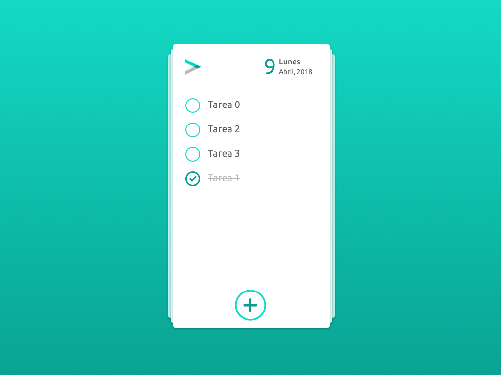

# Prueba técnica 6: TODO list

## Resumen

Ya está bien de desorden y de no llegar a nada, **nos vamos a hacer nuestra propia lista de tareas diaria**, hombre ya!

## Guía funcionalidad
En este prototipo podéis ver las acciones principales: [https://sketch.cloud/s/KA9e1/all/todo-list/principal/play](https://sketch.cloud/s/KA9e1/all/todo-list/principal/play)

> PISTA: En el prototipo, si hacéis clic en el fondo verde se mostrarán los elementos interactivos ;)

  

### Acciones
Vamos a realizar una aplicación simple de lista de tareas con una funcionalidad básica:
1. Completar una tarea
2. Desmarcar una tarea completada
3. Añadir una tarea nueva

## Especificaciones
* El ejercicio se realizara en JS sin ayuda de frameworks o librerías externas
* La principal prioridad es que se puedan completar las tareas o acciones pedidas
* La siguiente prioridad, una vez resuelta la principal, es acercarse lo más posible a las guías gráficas ofrecidas
* La lista de tareas se tiene que almacenar en el **Local Storage** del navegador, de manera que si recargamos la página no perdamos la información
* Tiene que aparecer la fecha actual ;)
* **Todo se desarrolla en la misma página, solo hay 1**.

### Tareas:
- **Completar una tarea:** Hacer clic en una tarea, o en su checkbox, marca la tarea como completada y la coloca al final de la lista
- **Desmarcar una tarea completada:** Hacer clic en una tarea completada, o en su checkbox, marca la tarea como pendiente y la coloca al principio de la lista
- **Añadir una tarea nueva**: muestra una capa donde podremos rellenar el nombre de la tarea y añadirla. Aparecerá en primer lugar.

## Entrega
Tenéis que crear un nuevo repositorio en GitHub desde GitHub Classroom usando [este enlace](https://classroom.github.com/a/AsPeO-gh). Una vez creado invitaremos a nuestro voluntario, lo clonaremos en nuestro ordenador y en la carpeta creada empezaremos a trabajar en el ejercicio.

## Guión exposición
Os proponemos un guión para presentar el ejercicio pero el entrevistador podrá variarlo o redirigirlo en cualquier momento:
- Planificación con la lista de acciones disponibles y descripción, uno a uno, de los pasos necesarios para realizarlas (previa a la programación)
- Lista de funciones finales en nuestro código y comparación con la planificación principal
- Comprobación de las acciones requeridas
- Comprobación del almacenamiento en el Local Storage del navegador
- Acercamiento gráfico

## Guía gráfica

### Listado de tareas

### Añadir tarea

