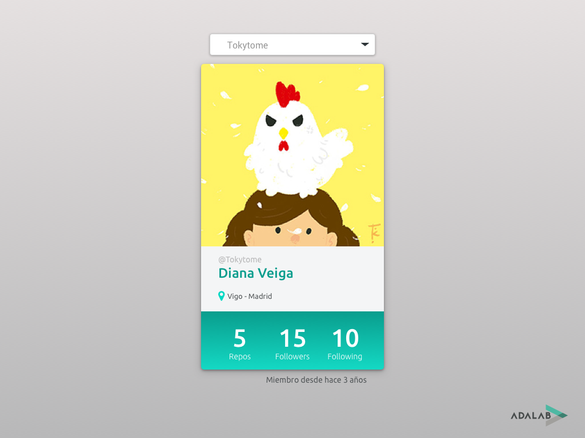

# Prueba técnica 7: Github Card

## Resumen

Ya somos unas cuantas en Adalab, ¿no sería genial tener un pequeño directorio donde buscarnos? Pues nos lo vamos a hacer, claro que sí!

## Guía funcional
Tiraremos de la [API de GitHub](https://developer.github.com/v3/) para conseguir la url a la que debemos pedir la lista de miembros de la organización Adalab, con esos datos crearemos un `<select>` con los nombres de usuario. Al seleccionar uno de ellos, pediremos sus datos y los mostraremos en una pequeña card. Se puede probar el funcionamiento en este prototipo: [https://sketch.cloud/s/drlRZ/all/github-card/00-principal/play](https://sketch.cloud/s/drlRZ/all/github-card/00-principal/play)

> PISTA: En el prototipo, si hacéis clic en el fondo gris se mostrarán los elementos interactivos ;)

## Especificaciones
* Antes de empezar tendréis que hacer una pequeña planificación del trabajo, en texto, sin nada de código:
	- Un esquema del funcionamiento
	- Qué acciones necesitaremos realizar y pasos concretos para realizarlas
	- Qué acciones son de ejecución obligatoria y cuales responderán a eventos
* Esta vez no os daremos la dirección, tendréis que buscarla en la documentación de la [API de GitHub](https://developer.github.com/v3/)
* **La prioridad 1 es que funcione**
* La prioridad 2 es acercarse lo más posible al aspecto propuesto en el prototipo
* El dato de "Miembro desde hace X años/meses" **ES OPCIONAL**. Si ya has terminado todo se trata de indicar cuánto tiempo lleva dicho usuario siendo miembro de Github
* Por defecto, la API nos devolverá 20 resultados, más que suficiente para el ejercicio. Si nos venimos arriba y queremos sacar a todo el mundo, en Adalab somos 68 criaturas, añadiendo `?per_page=68` a la url de la petición y estaremos todas

## Entrega
Tenéis que crear un nuevo repositorio en GitHub desde GitHub Classroom usando [este enlace](https://classroom.github.com/a/GLqnF98y). Una vez creado invitaremos a nuestro voluntario, lo clonaremos en nuestro ordenador y en la carpeta creada empezaremos a trabajar en el ejercicio.

## Guión exposición
Os proponemos un guión para presentar el ejercicio pero el entrevistador podrá variarlo o redirigirlo en cualquier momento:
- Revisión del esquema de planificación y listado/tipo de acciones
- Flujo de programación
- Gestión de los errores (fallo de la petición, usuario no existente... )
- Componentes html
- Estilos
- BONUS: información del tiempo que lleva un usuario siendo miembro de GitHub
