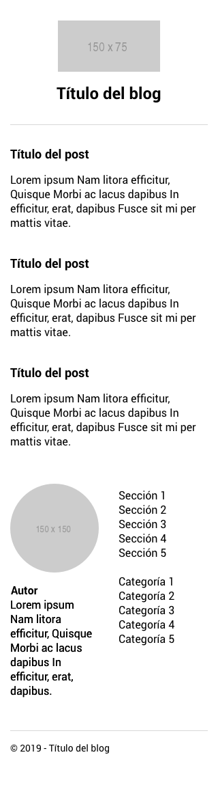
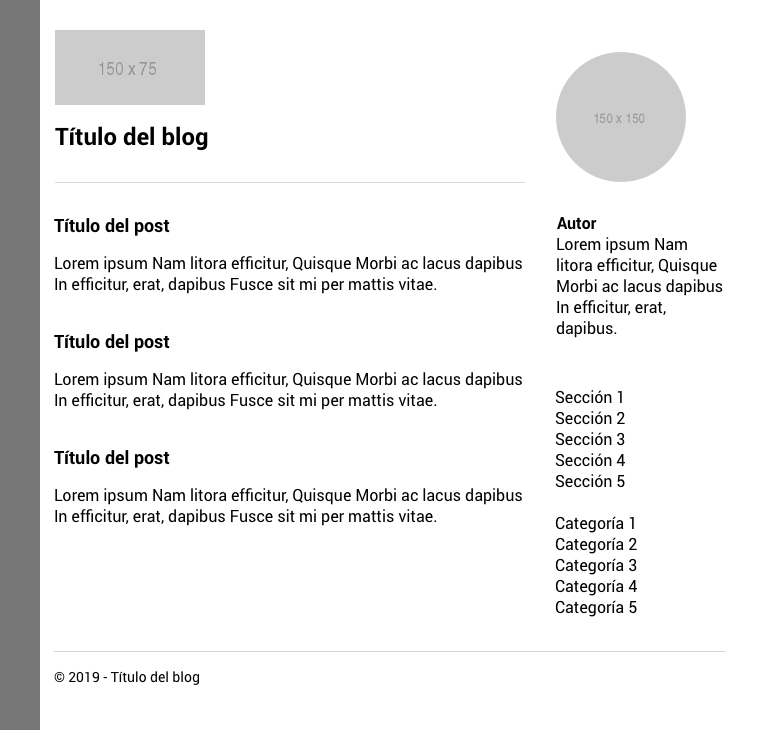
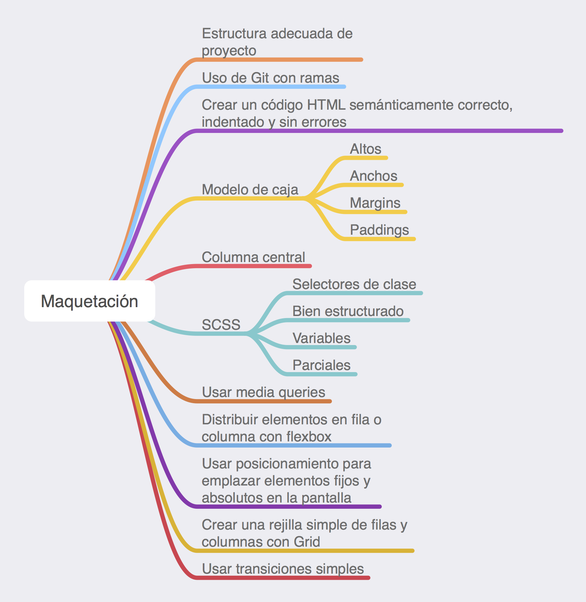

# Repaso módulo 1

## Ejercicio de repaso

Dado este wireframe, vamos a realizar la maquetación responsive.

> Versión mobile

> Versión tablet/desktop

## Resumen del módulo

## Librerías

- [Font Awesome](https://fontawesome.com/)
- [Google fonts](https://fonts.google.com/)
- [Bootstrap](https://getbootstrap.com/)
- [Animate.css](https://daneden.github.io/animate.css/)
- [Bulma.css](https://bulma.io/)
- [Susy](https://www.oddbird.net/susy/)
