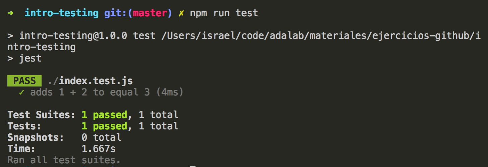
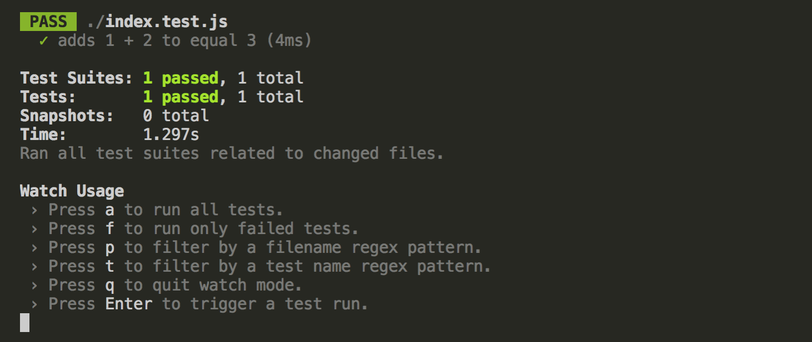

# Introducción al testing con JavaScript

## Contenidos

<!-- TOC depthFrom:4 depthTo:4 -->

- [EJERCICIO 1](#ejercicio-1)
- [EJERCICIO 2:](#ejercicio-2)
- [EJERCICIO 3](#ejercicio-3)
- [EJERCICIO 4](#ejercicio-4)
- [EJERCICIO 5](#ejercicio-5)

<!-- /TOC -->

## Introducción

En esta sesión vamos a tener un primer contacto con el testing automático de nuestros proyectos de front-end, en concreto, de la parte de JavaScript.

Testing es ni más ni menos que probar que una aplicación funciona como se espera, es decir, que cumple con los requisitos con los que se definió. _¿Hasta ahora hemos estado haciendo testing?_ Pues claro: cada vez que creamos una funcionalidad en una web la vamos probando manualmente: abrimos el navegador y probamos, por ejemplo, que la tarea se tacha al marcarla como completada en nuestra lista de tareas, o que las nuevas tareas se guardan en LocalStorage y al recargar el navegador siguen ahí.

Todas estas pruebas las hacemos de forma manual, es decir, miramos directamente en el navegador si sucede el comportamiento que esperamos. Si no, pues hay un error y toca _debuggearlo_. ¿Existen otras formas de hacer testing? Sí, por ejemplo, los test de usuario se hacen para que un potencial usuario de nuestra web pruebe nuestro producto y nos de feedback. También tenemos los **tests automáticos**, que son en los que nos vamos a centrar en esta sesión. Estos test, en lugar de realizarlos nosotras a mano los va a realizar una máquina por nosotros para hacerlo de forma más rápida y evitarnos ese trabajo tedioso de ir probando manualmente que todo funciona correctamente. ¿Y cómo es posible? Pues porque los vamos a programar. _¿¡A programar!?_ Pues sí, desarrollaremos por tanto un programa (se le llama _código de tests_) que prueba que nuestra aplicación (se le llama _código de producción_) funciona correctamente.

## ¿Para qué sirve lo que vamos a ver en esta sesión?

Desarrollar tests automáticos para un proyecto de software sirve principalmente para garantizar su calidad. A simple vista puede parecer poco, pero es demostrar que nuestro producto funciona como se espera y que no va a tener fallos (o al menos una serie determinada de fallos). Todo software serio tiene asociado un proceso de testing que, muchas veces, incluirá tests automáticos. En esta sesión aprenderemos a escribir tests automáticos que nos servirán para asegurar la calidad del código JavaScript que tenemos en el front-end de nuestra web.

Pero el testing, ¿lo hace también la programadora? ¿No hay equipos de QA (Quality Assurance) que se encargan de esto? Pues depende de cómo lo gestione la empresa. Pero, en general, los tests unitarios (que veremos qué son más adelante) van a ser responsabilidad de la propia programadora. Es decir, que debes ser responsable de que el código que entregas (que subes en un PR) funciona como se ha establecido en los requisitos.

Siendo la calidad el principal objetivo de desarrollar tests automáticos, existen otras consecuencias positivas. Una de ellas es mejorar la documentación del proyecto. Es decir, si tengo escrito un test que dice cómo funciona mi web entonces cuando alguien venga en el futuro a ver cómo funciona (que puedo ser yo misma dentro de unos meses o semanas) podrá leer el test y entenderlo.

Otra ventaja de tener tests automáticos relacionada con la calidad es combatir los _errores de regresión_. ¿Nunca os ha pasado que, al escribir código para una nueva funcionalidad de nuestra app... estropeamos algo que ya funcionaba? Pero quizá no nos damos cuenta en el momento porque solo hemos probado manualmente la nueva funcionalidad. Al tener tests automáticos (llamados _tests de regresión_), podremos detectar inmediatamente si estamos _rompiendo_ funcionalidades ya implementadas y actuar en consecuencia.

## ¿En qué casos se utiliza?

Como hemos mencionado antes, quién es responsable del testing depende de la empresa. De hecho, hay empresas (o clientes) que no quieren hacer testing automático. Pero cada vez más empresas se van dando cuenta de que es muy importante garantizar un mínimo de calidad en su software sobre todo para proyectos grandes, y la forma fundamental de garantizar esa calidad es tener una batería de tests automáticos. Como programadoras además, nos va a dar una sensación de tranquilidad saber que los tests están velando por nosotras. Que, por muy mal que vaya la cosa, garantizamos que ciertas cosas van a funcionar tal y como queremos.

## Testing

Dado que en esta sesión vamos a hablar de tests automáticos, vamos a dar una definición de diccionario:

> En las pruebas de software, la **automatización de pruebas** consiste en el uso de software especial (casi siempre separado del software que se prueba) para controlar la ejecución de pruebas y la comparación entre los resultados obtenidos y los resultados esperados.
>
> _Fuente_: [wikipedia](https://es.wikipedia.org/wiki/Automatizaci%C3%B3n_de_pruebas)

### Tipos de testing

Existen muchas clasificaciones de testing, pero aquí hemos elegido una de las más aceptadas que clasifica los tests por su nivel de granularidad en:

- **tests unitarios**: prueban un trozo de código (pieza) que solo hace una cosa (unidad), por ejemplo, una función
- **tests de integración**: prueban que varias piezas de código funcionan bien juntas, por ejemplo, una función que llama a otras funciones; podemos juntar tantas piezas como queramos, hasta llegar a la aplicación completa
- **tests de aceptación o _end-to-end_**: son un tipo especial de tests de integración que están relacionados con los criterios de aceptación definidos por el cliente, es decir, que prueban algo que tiene valor a nivel de negocio; por ejemplo, que un usuario puede crear una tarea nueva en nuestra aplicación de gestión de tareas

En el front-end normalmente vamos a tener muchos tests de integración puesto que estamos continuamente interactuando con componentes externos a nuestro código. Por ejemplo, serán tests de integración los que comprueban que algo se pinta bien en el DOM, guardan algo en LocalStorage o hacen una petición a un API.

Aún así, en esta sesión nos centramos en aprender a los tests más básicos, los unitarios, que son la base sobre la que se cimenta el testing automático.

### Anatomía de un test unitario

Como ya sabemos, los tests unitarios son una porción de software que se encarga de probar una funcionalidad pequeña de nuestra aplicación. Estos tests tienen una estructura que es siempre igual y que contiene estas 3 partes en este orden:

1. **Preparación**: en esta parte del tests preparamos el código para poder realizar la prueba. Por ejemplo, si probamos un método de una clase, primero tendremos que crear un objeto de esa clase para probarlo.
1. **Actuación**: realizamos la acción que queremos probar. Por ejemplo, invocar un método con unos parámetros.
1. **Aserción**: comprobamos si el resultado de la acción es el esperado. Por ejemplo, el resultado de la invocación del método anterior tiene que devolver un valor determinado.

En inglés estas partes tienen un acrónimo que es muy fácil de recordar _AAA_ (la triple _A_): _Arrange Act Assert_.

Vamos a ver un ejemplo de código aunque todavía no entendamos muy bien qué hace:

```js
test('fizzbuzz returns 1 when the input is 1', () => {
  //Arrange
  const number = 1;

  //Act
  const result = fizzbuzz(number);

  //Assert
  expect(result).toBe(1);
});
```

Este código comienza por una descripción de la regla que debe cumplir el test: debe devolver 1 cuando el parámetro de entrada a la función es 1. Luego, en el test en sí, primero preparamos un parámetro en una variable (_arrange_); luego ejecutamos una función `fizzbuzz` y recojo el resultado en otra variable (_act_); y finalmente compruebo si el resultado tiene el valor que espero (_assert_) usando la función `expect` que veremos más adelante para qué sirve.

A la hora de hacer tests es fundamental que los requisitos de cómo tiene que funcionar lo que hemos programado sean claros y tangibles. Por ejemplo, si hemos programado un campo de formulario para una contraseña deberemos tener claro si ese campo debe tener un mínimo de caracteres, si está permitido usar espacios o caracteres especiales, qué sucede cuando el usuario pulsa el botón de enviar y la fecha es incorrecta, etc.

En algunos casos se nos pasará algún detalle de estos requisitos, no pasa nada es normal y nos ha pasado a todos. Lo importante es que queden claras las reglas fundamentales que debemos testear y haya tests para probar esas reglas. Imagina la repercusión si eres un banco y tu campo de contraseña no funciona porque no se pueden meter números.

### Características de los tests unitarios

Los test unitarios se definen una serie de características

- **Rápidos**: comparados con los tests de integración, los unitarios deben ejecutarse muy rápido. Por ejemplo, cientos de tests en menos de un segundo. Son rápidos en comparación con los de integración, ya que muchos de ellos acceden a sistemas externos (APIs, base de datos, etc).
- **Aislados**: los test unitarios deben probar una funcionalidad aislada de nuestra aplicación, es decir, una porción de código. Por ejemplo, un componente sin hacer uso de otros componentes internos (otro componente hecho por mí) ni externos (DOM, API, etc).
- **Repetibles**: cuando repito un test con las mismas condiciones, el resultado debe ser el mismo. Por ejemplo, es complicado hacer tests de cosas no predecibles como números aleatorios o cuando alguna condición depende del tiempo.
- **Automatizados**: se deben poder comprobar sin intervención humana. Por ejemplo, no debe haber una persona revisando logs manualmente sino que debe ser un proceso totalmente automático.
- **Hechos a tiempo**: deberíamos hacer estos tests antes de que sucedan los errores, no a consecuencia de ellos. Y según _TDD_ (metodología que veremos más adelante) deben ser hechos antes incluso del código.

De nuevo, existe un acrónimo en inglés para recordar estas característica: _FIRST - Fast, Isolated, Repeatable, Self verifying, Timely_.

## Testing en JavaScript

Ahora que ya tenemos unos conocimientos básicos de testing, vamos a ver qué herramientas tenemos para poder hacer testing de nuestra aplicación en JavaScript. Hay montones de herramientas disponibles, pero vamos a centrarnos en una que está muy ampliamente adoptada en la comunidad de React: Jest. Esta herramienta nos proporciona mucha funcionalidad, pero vamos a centrarnos en lo más básico.

### Instalación

Para instalar Jest en nuestro proyecto lo hacemos usando `npm`. Para eso, tenemos que tener un fichero `package.json` que gestione las dependencias de nuestra aplicación.

---

#### EJERCICIO 1

**Instalación de Jest**

En primer lugar tenemos que crear un proyecto nuevo, pero no usaremos create-react-app ni Adalab Starter Kit. Vamos a crearlo siguiendo los pasos descritos a continuación. En nuestro ordenador creamos una carpeta `intro-testing` y nos movemos a ella desde la terminal. Después tenemos que ejecutar estos comandos:

```
npm init
```

Vamos rellenando los datos y al final se crea nuestro `package.json`. Cuando nos pida el comando para ejecutar los tests, ponemos `jest` (si lo olvidamos, siempre podemos modificar a mano el `package.json` en la sección de `scripts`).

```
npm install --save-dev jest
```

Ya hemos instalado Jest en el proyecto como dependencia de desarrollo (normalmente en producción no lo vamos a necesitar).

Como vamos a hacer control de versiones, ejecutamos también `git init` para inicializar nuestro repo con Git.

Ahora vamos a crear 2 ficheros JavaScript:

- `index.js`: donde estará el código de nuestro programa. Como prueba, vamos a crear una función sencilla de suma, y que exportamos al final del fichero.

```js
function sum(a, b) {
  return a + b;
}
module.exports = sum;
```

- `index.test.js`: donde estará el código de los tests. Al comienzo importamos la función del fichero anterior, y luego hacemos un test que prueba la función de suma.

```js
const sum = require('./index');

test('adds 1 + 2 to equal 3', () => {
  expect(sum(1, 2)).toBe(3);
});
```

> NOTA: fíjate que estamos usando `require` y `module.exports` para manejar módulos en lugar del `import` / `export` que usábamos en React, puesto que aún no funciona hasta las últimas versiones de Node.js

Normalmente tendremos un fichero de test por cada fichero JavaScript del código de nuestra aplicación. El nombre del fichero de test será similar al de la aplicación pero metiendo `.test` o `.spec` antes de la extensión del archivo (`.js` en este caso).

Para ver si todo está funcionando, ejecutaremos `npm test` en la terminal. Tras hacerlo se ejecutará el script de test que hemos configurado en `package.json`. Si hasta ahora hemos seguido los pasos correctamente, obtendremos como resultado que el test está correcto.



> NOTA: si no queremos estar ejecutando `npm test` continuamente para comprobar el resultado de nuestros tests, existe la opción de configurar `jest --watch` en nuestro `package.json` que estará ejecutando los tests continuamente según guardemos los ficheros. PARA USAR ESTO NECESITAREMOS ESTAR EN UN REPO GIT, escribir `git init` en la consola bastará ;)



---

### Definiendo tests y test suites

Ya tenemos Jest funcionando. Ahora vamos a ver cómo lo usamos para escribir nuestros tests. En primer lugar, vamos a recordar el ejemplo inicial de un test sencillo:

```js
test('fizzbuzz returns 1 when the input is 1', () => {
  const number = 1; //Arrange

  const result = fizzbuzz(number); //Act

  expect(result).toBe(1); //Assert
});
```

En el ejemplo, usamos la función `test` (también puede usarse `it` que funciona igual) para definir un nuevo test, y les pasamos 2 parámetros

- un string con la descripción del test
- una función con el contenido del test

En esta función ejecutamos el código para realizar la prueba. Recordamos las partes: preparación, actuación y aserción. No siempre vamos a tener las 3 partes, por ejemplo, la de preparación no es obligatoria y a veces pueden mezclarse actuación y aserción en la misma línea. Preparación y actuación usan código JavaScript normal, pero en la aserción usamos otra función auxiliar de Jest `expect` que sirve para hacer la comprobación de nuestro test. A `expect` le pasamos el valor que queremos comprobar, en este caso el valor de la variable `result`. Después encadenamos un _matcher_, es decir, el tipo comprobación que queremos hacer sobre el resultado. En este caso usamos el matcher `toBe` y le pasamos un 1, es decir, que estamos comprobando que el valor de la variable `result` sea 1.

> NOTA: ¿Pero para esto no podemos usar un `if`? Pues en realidad estamos haciendo una comprobación como en un if, pero no queremos ejecutar código dependiendo de una condición (que es lo que nos permite `if`) sino indicar una condición para que el test sea correcto.

Cuando tenemos muchos tests normalmente vamos a querer agruparlos en los llamados _test suites_. Para definirlo en Jest usamos la función `describe` a la que pasamos una descripción del suite y una función cuyo contenido son los tests.

```js
describe('Fizzbuzz', () => {
  test('returns 1 when the input is 1', () => {
    const number = 1; //Arrange

    const result = fizzbuzz(number); //Act

    expect(result).toBe(1); //Assert
  });

  test('returns 2 when the input is 2', () => {
    const number = 2; //Arrange

    const result = fizzbuzz(number); //Act

    expect(result).toBe(2); //Assert
  });
});
```

### Matchers

Jest nos ofrece un montón de matchers para comparar el resultado de nuestra actuación con el resultado esperado. Antes hemos usado `toBe` que equivale a comparar con un `===`. Para la mayoría de los casos nos servirá con `toBe`, pero existen otros, por ejemplo:

- `toEqual` para comparar el contenido de 2 objetos o arrays
- `toBeGreaterThan` para comparar que un número es mayor que otro
- `toContain` para comprobar que un array contiene un valor

Puedes encontrar en resto de matchers y algunos tutoriales en la [documentación de Jest sobre matchers](https://facebook.github.io/jest/docs/en/using-matchers.html).

---

#### EJERCICIO 2:

Partiendo del código del ejercicio 1, vamos a:

- añadir un test que pruebe que la función `sum` es capaz de sumar números positivos y negativos
- añadir un test que pruebe que la función `sum` es capaz de sumar números decimales
- meter todos los test en un test suite con la descripción `Sum App`

---

#### EJERCICIO 3

**Kata Padding**

A los ejercicios de programación que se usan para practicar testing muchas veces se les llama katas. Esta kata consiste en crear una función `paddingLeft` que se encarga de meter caracteres de relleno en un cadena por el lado izquierdo hasta llegar a un tamaño deseado. Toma 3 parámetros

- La cadena inicial
- Un tamaño final
- Un valor del padding, por defecto es un espacio

Si el tamaño final es menor o igual que la cadena inicial, se devuelve sin tocar la inicial.

Ejemplos:

- `paddingLeft('hola', 6, 'x')` devuelve `'xxhola'`
- `paddingLeft('hola', 6, 'a')` devuelve `'aahola'`
- `paddingLeft('ee', 4, 'aa')` devuelve `'aaee'`
- `paddingLeft('xxxx', 6, 'x')` devuelve `'xxxxxx'`
- `paddingLeft('', 6, 'x')` devuelve `'xxxxxx'`
- `paddingLeft('hola mi amigo', 6, 'x')` devuelve `'hola mi amigo'`
- `paddingLeft('xxxx', 0, 'x')` devuelve `'xxxx'`

En primer lugar, desarrollad el código de la función `paddingLeft` en un fichero. Cuando lo tengáis, cread un fichero de tests y cread un test para cada uno de los ejemplos anteriores. Así estamos comprobando que la función hacía lo que se ha pedido que haga.

---

#### EJERCICIO 4

**ES6 katas**

La web http://es6katas.org/ nos da una series de katas para repasar nuestros conocimientos de JavaScript, en concreto, de las novedades que trajo la versión ES6.

Para trabajar en una característica, hacemos clic en su nombre, por ejemplo, `string.includes()`. Esto nos lleva a una página donde tenemos un código de tests (editable) a la izquierda y el resultado de la ejecución de los tests a la derecha. Al comenzar todos los tests están en rojo, es decir, están fallando. El ejercicio consiste en modificar el código de la izquierda para ir arreglando los tests uno a uno, y que pasen a verde. Es muy importante ir leyendo la descripción de los tests porque nos dará pistas sobre qué característica de JS debemos usar para pasar el test. Para arreglar los tests podemos modificar el código excepto las líneas que tienen una sentecia `assert`. Esta función es equivalente al `expect` que hemos visto antes:

```js
expect(result).toBe(1);

//ES EQUIVALENTE

assert.equal(result, 1);
```

Vamos a ver por ejemplo el primer test de la sección de `string.includes()`:

```js
describe('`string.includes()` determines if a string can be found inside another one', function() {
  describe('finding a single character', function() {
    it('can be done (a character is also a string, in JS)', function() {
      const searchString = 'a';
      assert.equal('xyz'.includes(searchString), true);
    });
```

Leyendo la descripción del test nos explica qué hace includes. Para pasar el test sin modificar la línea del `assert` debemos modificar el valor de la variable `searchString` para que sea parte de la cadena `'xyz'`. Por ejemplo:

```js
const searchString = 'x';
```

Modificamos esa línea en la parte izquierda y le damos al botón 'Run tests' o las teclas Control + S. Se ejecurarán de nuevo los tests y el primero aparece pasado (en verde).

Debéis conseguir pasar el resto de tests de este fichero. Algunas katas que os recomendamos para repasar ES6 en el futuro: string, template strings, destructuring, rest operator, spread operator, arrow functions, array.find, block scope

---

## BONUS: Introducción a TDD

TDD es una metodología de programación dentro de una metodología de trabajo denominada _eXtreme Programming_ o _XP_. XP define una serie de técnicas para mejorar los procesos de desarrollo de productos digitales, dentro de un marco de trabajo ágil. Algunas técnicas de XP son

- _pair programming_ o programación en parejas, que tiene toda una metodología de trabajo
- _code reviews_ o revisiones de código, antes de integrar un código es mejor que lo revisen programadoras que no lo han hecho
- integración continua, que consiste en integrar continuamente (diariamente) el código de todas las programadoras del proyecto
- despliegue continuo, que consiste en desplegar a producción continuamente nuevas versiones de nuestra aplicación
- _refactoring_, que pone de relieve la importancia de la calidad interna del código
- TDD o _Test Driven Development_, que es desarrollo dirigido por tests, es decir, que los tests son los que dirigen cómo programamos

Estas técnicas tienen dependencias entre ellas. Por ejemplo, no podré hacer despliegue continuo si no tengo integración continua de código antes. Y no podré tener integración continua (sin errores) si no tengo tests. También es mucho más difícil realizar refactorizaciones sin tener tests.

En esta sesión vamos a aprender TDD que consiste en **escribir los tests antes que el código**. Simplemente eso :) 🔥 (Acabo de oír cómo te explota la cabeza).

Al principio suena a locura el pensar que vamos a escribir algo que prueba un código sin tener ese código que queremos probar pero si nos paramos a pensar un momento siempre que empezamos a programar un código lo primero que necesitamos saber son los requisitos que debe tener ese código para que funcione correctamente. Pensemos en una función `isOdd` que comprueba si un número es impar o no. A menudo la reacción básica es ponernos a escribir el código y probar mil variaciones distintas y escribir, en muchas ocasiones, más código del que necesitamos. Pero lo lógico es empezar pensando qué queremos que haga esa función y por tanto cuáles son los requisitos o las reglas que debe pasar para que consideremos que funciona correctamente. En este caso sería:

- Si es un número par devuelve `true`
- Si es número impar devuelve `false`
- Si lo que me pasan no es un número devuelve un error

Estos son los requisitos, simples y claros. De haber empezado por el código estaríamos pensando en `if`s y `else`s en vez de definir qué es lo que queremos. Una vez hecho esto, el siguiente paso sería pasar esos requisitos a reglas uno a uno usando tests. Por tanto, la clave de TDD es que pensamos en qué queremos y cuáles son los criterios claros y tangibles para que eso funcione correctamente y a partir de ahí implementamos el código que cumplirá esas reglas.

### El ciclo de TDD

La metodología de TDD se basa en un proceso cíclico de 3 pasos:

1. Escribo un test definiendo qué tiene que hacer mi aplicación y lo veo fallar (se dice que el test _está en rojo_)
1. Escribo el código de producción para que ese test pase y lo veo pasar (se dice que el test _está en verde_)
1. Opcionalmente refactorizo el código de producción para mejorarlo, siempre que sigan pasando todos los tests ¡claro!

En inglés el ciclo de TDD se suele describir brevemente como _Red - Green - Refactor_.

La mejor forma de aprender a usar esta metodología es, como casi todo en programación, practicándola. Hemos preparado algunos ejercicios para practicarlo juntos.

Algunas indicaciones a la hora de practicar TDD:

- Es importante destacar que un test falla cuando el test está bien escrito pero lo que está probando (una función, por ejemplo) no se está comportando tal y como se ha establecido en el test. Si el test falla porque hay un error de sintaxis en él o porque dice que una variable no está definida es que tenemos un error en el test y deberemos corregirlo antes de pasar a la siguiente fase
- empezamos siempre con el test más simple, y por el _happy path_, es decir, sin pensar en casos límite sino el comportamiento normal de nuestra aplicación
- tenemos que pensar siempre en pequeños pasos (en inglés se suele decir _baby steps_) centrándonos solo en lo siguiente que queremos que nuestra aplicación pueda hacer.
- suele ser complicado definir los primeros tests, así que tenemos que pensar qué queremos que haga nuestra aplicación de esta forma, que está relacionada con las 3 partes de un test unitario:

```
    Dado ESTO
    Cuando hago ESTO OTRO
    Espero que el resultado sea ESTE
```

---

#### EJERCICIO 5

**Kata Fizzbuzz**

Usando TDD, desarrollamos una función Fizzbuzz que toma como parámetro un número y devuelve

- "fizz" si es múltiplo de 3
- "buzz" si es múltiplo de 5
- "fizzbuzz" si es múltiplo de 3 y 5
- el mismo número si no se da ninguno de los casos anteriores

Este ejercicio es equivalente a la kata del ejercicio 3, pero vamos a hacerla usando la metodoogía de TDD, es decir, escribiendo los tests primero.

---

## Recursos externos

- [Jest](https://facebook.github.io/jest/)
- [Diseño ágil con TDD](http://www.carlosble.com/libro-tdd/?lang=es)
- [Extreme Programming en Wikipedia](https://en.wikipedia.org/wiki/Extreme_programming)
