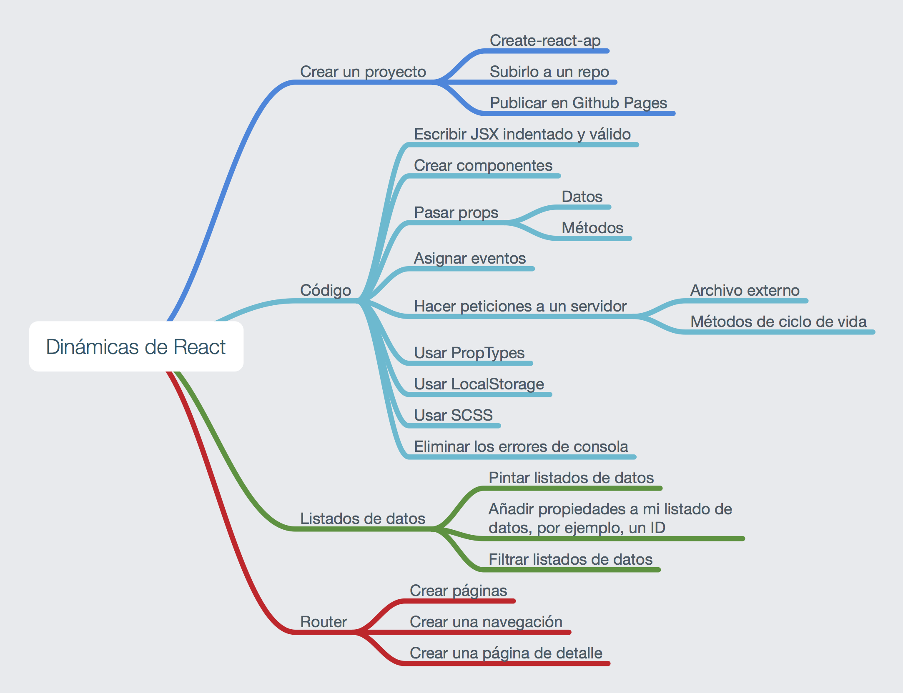

# Repaso módulo 3

## Ejercicios de repaso

- Repaso filtrado: https://github.com/Adalab/react-filters

- Repaso react router: https://github.com/Adalab/React-route-en-detalle

- Repaso de ciclo de vida: https://github.com/Adalab/react-router

- Directorio de personas: https://github.com/Adalab/people-directory

- Repaso completo de TODO list: https://github.com/Adalab/my-todo-list

- Repaso completo con pokemon: https://github.com/Adalab/react-pokerrepaso

## Resumen del módulo

